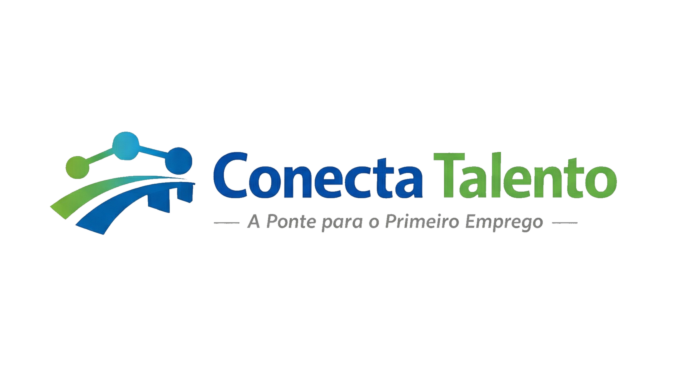
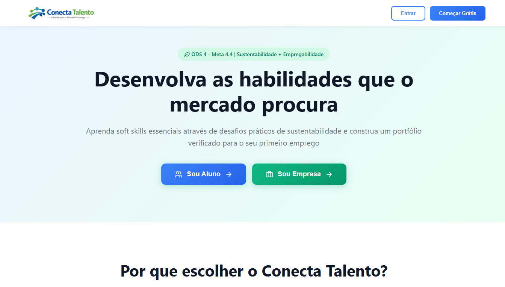
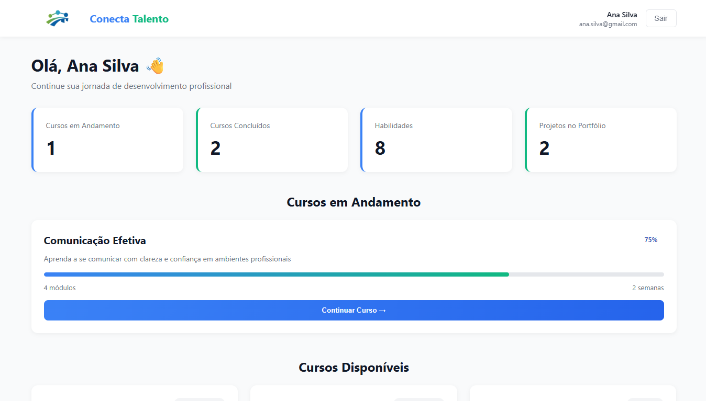
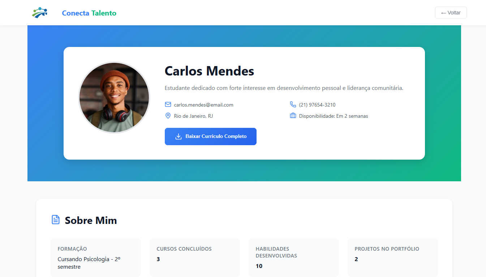
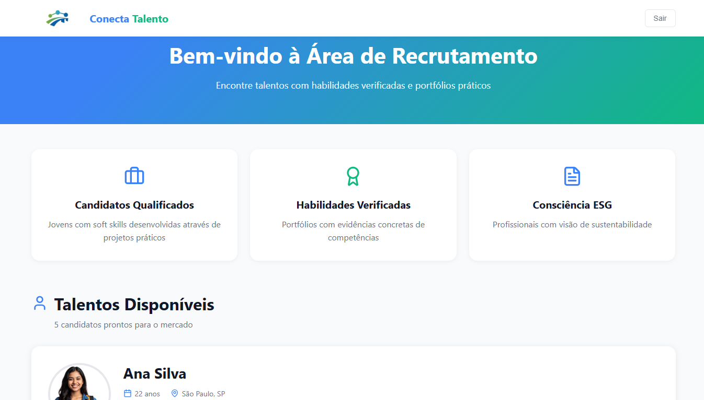

# Conecta Talento

<div align="center">



**A Ponte para o Primeiro Emprego**


</div>

---

## 📋 Sumário

- [Sobre o Projeto](#-sobre-o-projeto)
- [Demonstração](#-demonstração)
- [Funcionalidades](#-funcionalidades)
- [Tecnologias](#-tecnologias)
- [Estrutura do Projeto](#-estrutura-do-projeto)
- [Instalação](#-instalação)
- [Como Usar](#-como-usar)
- [Contribuindo](#-contribuindo)
- [Sobre o Desenvolvimento](#-sobre-o-desenvolvimento)

---

## 🎯 Sobre o Projeto

**Conecta Talento** é uma plataforma educacional inovadora alinhada ao **ODS 4 (Educação de Qualidade) - Meta 4.4**, focada em desenvolver soft skills essenciais para jovens em busca do primeiro emprego através de desafios práticos de sustentabilidade.

### 🌟 Diferenciais

- **Currículo Verificado, Não Certificado**: Ao invés de PDFs genéricos, os alunos constroem portfólios com evidências concretas de suas habilidades através de vídeos-desafios, projetos reais e simulações práticas.

- **Aprendizado Baseado em Sustentabilidade**: Todos os cursos incluem desafios práticos de impacto social e ambiental, preparando profissionais conscientes e alinhados com ESG.

- **Conexão Direta com Empresas**: Recrutadores podem visualizar portfólios verificados, projetos completos e habilidades comprovadas de cada candidato.

### 🎓 Para Estudantes

- Acesso 100% gratuito a cursos de soft skills
- Desenvolvimento através de projetos reais de sustentabilidade
- Construção de portfólio verificado com evidências práticas
- Geração automática de currículo em PDF com projetos validados
- Visibilidade para recrutadores

### 🏢 Para Empresas

- Acesso a candidatos com habilidades verificadas
- Visualização completa de portfólios com projetos reais
- Contato direto com talentos qualificados
- Profissionais com consciência ESG

---

## 🎬 Demonstração

### Tela Inicial

*Apresentação da plataforma com foco em ODS 4 e sustentabilidade*

### Dashboard do Aluno

*Área do estudante com cursos em andamento, disponíveis e estatísticas de progresso*

### Portfólio do Estudante

*Portfólio verificado com projetos, habilidades e certificados*

### Área da Empresa

*Interface de recrutamento com visualização de talentos disponíveis*

---

## ✨ Funcionalidades

### 🔐 Autenticação e Cadastro
- [x] Login para estudantes e empresas
- [x] Cadastro de novos usuários
- [x] Gerenciamento de sessão via Context API
- [x] Navegação protegida por tipo de usuário

### 👨‍🎓 Funcionalidades do Estudante
- [x] Dashboard personalizado com métricas de progresso
- [x] Visualização de cursos (em andamento, disponíveis, concluídos)
- [x] Detalhes completos de cada curso
- [x] Sistema de módulos e aulas
- [x] Portfólio verificado com projetos
- [x] Geração automática de currículo em PDF
- [x] Perfil público para recrutadores

### 🏢 Funcionalidades da Empresa
- [x] Listagem de talentos disponíveis
- [x] Visualização de portfólios completos
- [x] Acesso a informações de contato
- [x] Filtros por habilidades e experiência
- [x] Estatísticas de cada candidato

### 📄 Geração de Currículo
- [x] PDF profissional com logo da plataforma
- [x] Informações pessoais e de contato
- [x] Resumo sobre o candidato
- [x] Lista de habilidades principais
- [x] Projetos em destaque com impacto medido
- [x] Selo de verificação ODS 4

---

## 🛠 Tecnologias

### Core
- **React 18.3** - Biblioteca JavaScript para interfaces
- **Vite 5.4** - Build tool e dev server
- **React Router DOM 7.1** - Roteamento SPA

### UI/UX
- **Lucide React 0.469** - Biblioteca de ícones
- **CSS3** - Estilização customizada
- **Design Responsivo** - Mobile-first approach

### Utilitários
- **jsPDF 2.5.2** - Geração de PDFs
- **Context API** - Gerenciamento de estado global

---

## 📁 Estrutura do Projeto

```
conecta-talento/
├── public/
│   └── students/           # Fotos de perfil dos estudantes
├── src/
│   ├── assets/
│   │   ├── logo.png       # Logo pequeno
│   │   ├── logofull.png   # Logo completo
│   │
│   ├── components/
│   │   └── data/
│   │       ├── students.js    # Dados dos estudantes
│   │       └── courses.js     # Dados dos cursos
│   ├── context/
│   │   └── UserProvider.jsx  # Context de autenticação
│   ├── pages/
│   │   ├── Home.jsx          # Landing page
│   │   ├── Login.jsx         # Autenticação
│   │   ├── AlunoHome.jsx     # Dashboard do aluno
│   │   ├── EmpresaHome.jsx   # Dashboard da empresa
│   │   ├── Portfolio.jsx     # Portfólio do estudante
│   │   └── CourseDetails.jsx # Detalhes do curso
│   ├── styles/
│   │   ├── Home.css
│   │   ├── Login.css
│   │   ├── AlunoHome.css
│   │   ├── EmpresaHome.css
│   │   ├── Portfolio.css
│   │   └── CourseDetails.css
│   ├── App.jsx              # Rotas principais
│   └── main.jsx            # Entry point
├── package.json
├── vite.config.js
└── README.md
```

---

## 🚀 Instalação

### Pré-requisitos
- Node.js 16+ 
- npm ou yarn

### Passos

1. **Clone o repositório**
```bash
git clone https://github.com/Livia9/A-Ponte-para-o-Primeiro-Emprego.git
cd conecta-talento
```

2. **Instale as dependências**
```bash
npm install
# ou
yarn install
```

3. **Inicie o servidor de desenvolvimento**
```bash
npm run dev
# ou
yarn dev
```

4. **Acesse a aplicação**
```
http://localhost:5173
```

---

## 📖 Como Usar

### 👨‍🎓 Guia para Estudantes

#### 1. Criando sua Conta
1. Na página inicial, clique em **"Sou Aluno"**
2. Na tela de login, clique em **"Cadastrar"**
3. Preencha seus dados:
   - Nome completo
   - Data de nascimento
   - Número de contato
   - E-mail
   - Senha
4. Clique em **"Criar Conta"**

#### 2. Explorando Cursos
1. No **Dashboard**, você verá três seções:
   - **Cursos em Andamento**: Cursos que você já começou
   - **Cursos Disponíveis**: Novos cursos para iniciar
   - **Cursos Concluídos**: Cursos finalizados com certificado
2. Clique em **"Ver Detalhes"** em qualquer curso para saber mais

#### 3. Iniciando um Curso
1. Na página de detalhes do curso, você verá:
   - Descrição completa
   - Desafio de sustentabilidade
   - Habilidades que irá desenvolver
   - Módulos e conteúdo programático
2. Clique em **"Iniciar Curso"** para começar

#### 4. Acessando seu Portfólio
1. Seu portfólio é automaticamente gerado conforme você completa cursos
2. Ele contém:
   - Suas informações de contato
   - Habilidades desenvolvidas
   - Projetos realizados com impacto medido
   - Certificados obtidos

#### 5. Baixando seu Currículo
1. No seu portfólio, clique em **"Baixar Currículo Completo"**
2. Um PDF profissional será gerado automaticamente com:
   - Seus dados pessoais
   - Resumo profissional
   - Habilidades principais
   - Projetos em destaque
   - Selo de verificação ODS 4

---

### 🏢 Guia para Empresas

#### 1. Acessando a Plataforma
1. Na página inicial, clique em **"Sou Empresa"**
2. Faça login com suas credenciais
3. Você será direcionado ao **Dashboard de Recrutamento**

#### 2. Explorando Talentos
No dashboard você verá todos os candidatos disponíveis com:
- **Foto e nome** do candidato
- **Localização e idade**
- **Resumo profissional**
- **Estatísticas rápidas**: 
  - Número de cursos concluídos
  - Projetos no portfólio
  - Habilidades desenvolvidas

#### 3. Visualizando Portfólios
1. Clique em **"Ver Portfólio Completo"** em qualquer candidato
2. Você terá acesso a:
   - Informações detalhadas de contato
   - Lista completa de habilidades
   - Todos os projetos realizados com descrição e impacto
   - Certificados obtidos
   - Formação acadêmica

#### 4. Entrando em Contato
1. No card do talento, você encontra:
   - **E-mail** para contato direto
   - **Telefone** do candidato
   - **Disponibilidade** atual
2. Clique em **"Entrar em Contato"** para enviar uma mensagem

---

### 💡 Dicas de Uso

#### Para Estudantes:
- ✅ Complete os desafios de sustentabilidade para enriquecer seu portfólio
- ✅ Mantenha suas informações de contato atualizadas
- ✅ Baixe seu currículo em PDF regularmente conforme adiciona novos projetos
- ✅ Explore todos os cursos disponíveis para desenvolver diferentes soft skills

#### Para Empresas:
- ✅ Analise os projetos práticos dos candidatos, não apenas as habilidades listadas
- ✅ Observe o impacto dos projetos em sustentabilidade - indica consciência ESG
- ✅ Use as estatísticas (cursos concluídos, projetos) como indicadores de comprometimento
- ✅ Entre em contato diretamente pelos dados disponíveis no portfólio

---

## 🤝 Contribuindo

Contribuições são sempre bem-vindas!

1. Fork o projeto
2. Crie sua feature branch (`git checkout -b feature/AmazingFeature`)
3. Commit suas mudanças (`git commit -m 'Add some AmazingFeature'`)
4. Push para a branch (`git push origin feature/AmazingFeature`)
5. Abra um Pull Request

---

## 🎓 Sobre o Desenvolvimento

Este projeto foi desenvolvido como **trabalho final do curso de Front-End** da **Bolsa Futuro Digital - Softex**, em parceria com a **UFF Petrópolis/RJ**.

### 📚 Contexto Acadêmico

O Conecta Talento foi criado para demonstrar as competências adquiridas durante o curso, incluindo:
- Desenvolvimento de interfaces modernas com React
- Gerenciamento de estado e rotas
- Componentização e reutilização de código
- Design responsivo e experiência do usuário
- Integração de bibliotecas externas
- Boas práticas de documentação

### 🎯 Objetivo Educacional

Além de cumprir os requisitos acadêmicos, o projeto visa apresentar uma solução real e aplicável para um problema social relevante: **a dificuldade de jovens em conseguir o primeiro emprego** por falta de comprovação prática de habilidades.

### 📌 Escopo Atual

- ✅ Interface completa e funcional para estudantes e empresas
- ✅ Sistema de navegação e roteamento
- ✅ Design responsivo e moderna experiência de usuário
- ✅ Geração de currículos em PDF
- ✅ Dados demonstrativos para simulação de uso real

### 🔮 Visão Futura

Para evolução do projeto além do escopo acadêmico, serão necessárias implementações de:
- Backend com API REST e banco de dados
- Sistema de autenticação seguro
- Plataforma de upload de vídeos para desafios práticos
- Sistema de mensagens entre estudantes e empresas
- Aplicativo mobile

---

<div align="center">

### 🌱 Comprometidos com o ODS 4

**Educação de Qualidade • Meta 4.4**  
*Aumentar substancialmente o número de jovens com habilidades relevantes para o emprego*

---

**Preparando jovens para o futuro do trabalho** 🚀

*Projeto desenvolvido por Equipe Épsilon - Turma Front-End Softex 2025*

</div>
